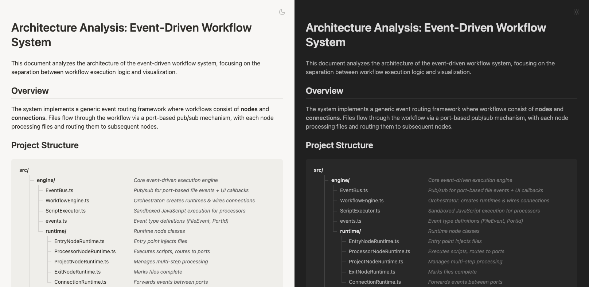

# Markdown Viewer

An unobtrusive Chrome extension that renders Markdown files in the browser.



## Features

- Auto-renders `.md` and `.markdown` files
- Syntax highlighting for code blocks
- Light/dark theme with auto-detection
- Mermaid flowchart rendering (sort of — this is still experimental)
- ASCII tree structure rendering (this is what I was missing everywhere else!)
- Toggle prettifying on/off va context menu 

## Installation

### From Source

1. Install dependencies and build:
   ```bash
   npm install
   npm run build
   ```

2. Open Chrome and go to `chrome://extensions/`

3. Enable "Developer mode" (toggle in top right)

4. Click "Load unpacked" and select the `dist` folder

5. For local files, click "Details" on the extension and enable "Allow access to file URLs"

## Usage

- **Auto-render**: Opens `.md` or `.markdown` files and automatically renders them
- **Context menu**: Right-click on any page and select "Prettify Markdown" to render, or "View raw Markdown" to revert
- **Toolbar icon**: Click the extension icon to toggle between rendered and raw markdown

## Dependencies

This extension uses the following packages:

- [tree-to-html](https://github.com/iafan/tree-to-html) - ASCII tree parsing
- [marked-tree-to-html](https://github.com/iafan/marked-tree-to-html) - Marked extension for trees
- [mermaid-flowchart](https://github.com/iafan/mermaid-flowchart) - Mermaid flowchart rendering
- [marked-mermaid-flowchart](https://github.com/iafan/marked-mermaid-flowchart) - Marked extension for mermaid
- [marked](https://github.com/markedjs/marked) - Markdown parser
- [marked-highlight](https://github.com/markedjs/marked-highlight) - Syntax highlighting
- [highlight.js](https://highlightjs.org/) - Code highlighting

## License

This is free and unencumbered software released into the public domain (Unlicense).
